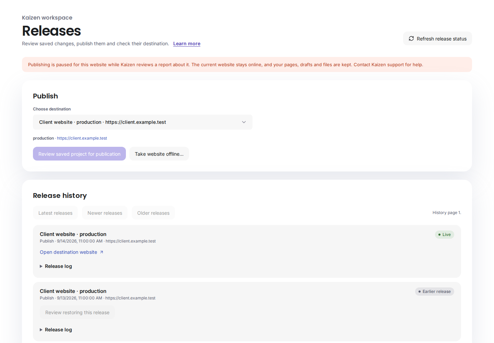
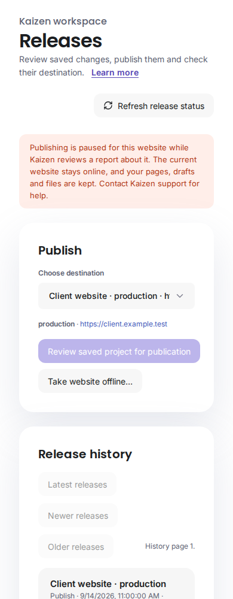

# Publication abuse controls and data-preserving suspension

**Status: implemented and verified in fixtures (L6-T4 E). Not deployed.** Installation belongs to the coordinated L6 rollout (F–G).

## What people see

- **Burst limits:** a website that publishes too often in a short time is told: "Too many publications in the last hour. Existing work is kept. Wait a while, then publish again."
- **Suspension:** when Kaizen reviews a report and pauses publishing, Releases shows: "Publishing is paused for this website while Kaizen reviews a report about it. The current website stays online, and your pages, drafts and files are kept. Contact Kaizen support for help." Publishing and restoring earlier releases are disabled; taking the website offline stays available.
- **Takedown:** after a takedown, Releases says the website has been taken offline while Kaizen reviews a report, and the served website shows the existing "temporarily unavailable" page.
- **Reports:** anyone can report a Kaizen-hosted website through `builder-report`. The sender is thanked and told that the website stays unchanged unless the review finds a problem.




## Burst limits

Limits are enforced where the monthly allowance is reserved, so every publishing path is covered: client publications, the original website's editor releases, and hosted repository publishing.

- **Allowance:** at most 30 reserved publications per website and 60 per billing account in any hour, counting failed attempts.
- **Retries:** an exact retry of an already reserved publication keeps its allowance and is never re-limited.
- **Exemptions:** taking a website offline and restoring an earlier release stay exempt from monthly limits as before. Restoring is still paused by a suspension.
- **Precision:** the per-website count is serialized by the existing project lock. The per-account count can overshoot by the number of websites publishing at the same instant; this is a monitored bound, not a hard one.

## Reports

- **Endpoint:** `supabase/functions/builder-report` accepts JSON from the origins in `BUILDER_REPORT_ORIGINS` (defaulting to the contact form origins). Required fields: `request_id`, `website` (https), `category` (`phishing`, `malware`, `spam`, `illegal`, `copyright` or `other`), `details` (10–4,000 characters), and an optional `contact` address. It uses the durable function limit (`builder-report`: 60 per minute globally), a hidden spam field and a 16 KiB body limit.
- **Stored data:** only the website origin is stored, never the full reported URL. The reporter is a keyed HMAC of their network address, never the address itself. An optional reply address is kept only so the operator can respond.
- **Database checks:** `builder_submit_abuse_report` is idempotent per request ID and refuses a changed replay. It allows five reports per reporter per hour and 10,000 open reports overall, and resolves the origin to a configured client destination or connected domain. Addresses Kaizen does not host are refused, and no report is created about the original Kaizen website.
- **Privacy:** report, suspension and audit tables are private to the database. Neither browsers nor the service role can read them directly; only the operator functions can.

## Operator review

Run `scripts/builder-abuse-operator.ts` on a trusted host with the service-role configuration (`SUPABASE_URL`, `BUILDER_RELEASE_SERVICE_ROLE_KEY`):

```bash
node --import tsx scripts/builder-abuse-operator.ts list --status open
```

```bash
node --import tsx scripts/builder-abuse-operator.ts suspend <project> --operator <name> --reason "<why>" --report <report>
```

```bash
node --import tsx scripts/builder-abuse-operator.ts takedown <project> --operator <name> --reason "<why>" --report <report>
```

```bash
node --import tsx scripts/builder-abuse-operator.ts restore <project> --operator <name> --reason "<why>"
```

```bash
node --import tsx scripts/builder-abuse-operator.ts dismiss <report> --operator <name> --outcome "<why>"
```

Every action requires a named operator and reason, closes the linked report, and appends to `builder_abuse_actions`. No command deletes a website, draft, file, billing record or recovery record. External notifications are not sent; replying to a reporter or owner is a manual decision.

## Suspension and takedown behaviour

A suspension (`builder_project_suspensions`) blocks, with the plain message above:

- new publish and restore reviews;
- new publish and restore jobs;
- the worker's claim of an already queued publish or restore;
- the step into activating, before any file switch;
- new hosted repository publication attempts and output reservations.

A job already past activation finishes normally, avoiding a half-switched website. Unpublication stays available.

The suspension has no cascade, so a suspended website cannot be purged while under review. The original Kaizen website cannot be suspended. Members can see only that publishing is paused and since when; the reason and report stay private.

**Takedown** additionally queues one operator unpublication job for each enabled destination that is not already offline. The existing client worker runs these through the verified unpublication path (stage the holding page, activate, verify, record evidence). Custom domains routed to that destination therefore stop serving the reported content too.

- **Operator jobs:** these have no customer requester (`operator_takedown`), so the five worker functions that recheck requester permission accept them explicitly. Destination, worker, token and baseline checks are unchanged.
- **Busy destinations:** a destination with pending work is reported back and can be taken down again once that work finishes.
- **Retained releases:** earlier releases stay retained.

**Restore** lifts the suspension and records it. It never republishes. An owner, or anyone with publish permission, restores service through the ordinary reviewed restore, which rechecks that the chosen release is still retained and that the destination is unchanged.

## Verification

- **SQL (PGlite, all migrations):**
  - burst limits per website and per account, with exact retries unaffected;
  - suspension refusals for reviews, jobs, claims and repository output, while unpublication still works;
  - purge refusal and the member-visible state;
  - restore and its audit trail, and refusal for the original Kaizen website;
  - report idempotency, conflicts, rate limits, unknown origins and invalid input;
  - takedown queuing the operator job and the worker claim accepting it, a repeated takedown reporting pending work, and report review states;
  - private tables and operator functions denied to browser roles.
- **Real client worker:** a publication queued before a takedown is refused at claim and marked failed. The takedown job is then run by `runClientPublication` against real release files, so the holding page is selected and served while the earlier release stays retained.
- **Access matrix:** now includes the three new private tables, with canaries.
- **Report handler and operator commands:** unit tests for the report validator, the request handler (origins, oversized bodies, spam field) and the operator command parser.
- **Edge (Deno):** the actual `builder-report` handler with the function limit, a keyed reporter hash, no raw address or query string in the submission, and plain 429/404/409/503 mappings.
- **React and browser:** React cases for the suspended and taken-down notices with publish and restore disabled, and a browser journey with desktop and phone screenshots.

`l6-t4-e-tests1.log`: complete `pnpm test` with actual Nginx, 1,534 cases across 126 files, zero skips; `l6-t4-e-types1.log`: 471 files, zero errors/warnings, 201 hints; `l6-t4-abuse-edge2.log`: Deno check of `builder-report`, `builder-projects` and `builder-publish`, and the full Edge suite (11 tests, 72 steps); `l6-t4-abuse-browser1.log`: the suspension browser journey, with desktop and phone screenshots inspected.

**Remaining for rollout:**

- apply migration 021 after 019–020;
- deploy `builder-report` with `BUILDER_REPORT_ORIGINS`, together with the matching `builder-projects` function and frontend;
- place a public report link and form (wording is a goal-end review item);
- decide report retention with the privacy policy.

No real notifications are sent.
